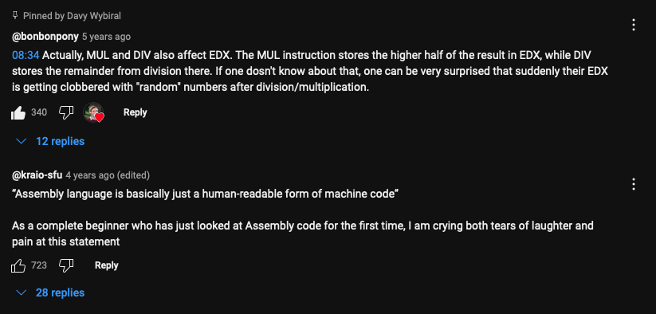

https://www.youtube.com/playlist?list=PLmxT2pVYo5LB5EzTPZGfFN0c2GDiSXgQe

Code made for [nasm assembler](https://www.nasm.us)
Use the [ld](https://linux.die.net/man/1/ld) linker

nasm -f elf32 write.asm -o write.o
ld -m elf_i386 write.o -o write 
./write 
echo $?

